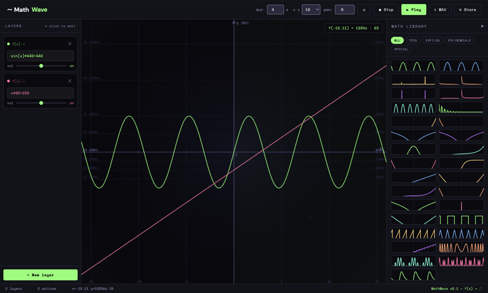

# 〜 MathWave

**Turn math functions into music.**

MathWave is a browser-based audio playground where mathematical functions become melodies. Write `f(x)` — the curve you draw _is_ the sound. Stack multiple functions as layers, explore the Cartesian plane, and export your composition as a WAV file.

%20→%20🎵-7fff6e?style=flat-square&labelColor=0a0a0f>)




---

## How it works

The **x-axis** is time. The **y-axis** is frequency (Hz). Every function `f(x)` traces a path through the Cartesian plane — that path is played back as audio using the Web Audio API.

```
sin(x)*440+440   →  oscillating melody around A4
x*80+220         →  rising glissando
pow(x,2)*20+100  →  accelerating parabolic climb
floor(x)*80+220  →  stepped staircase of notes
```

Stack multiple functions as independent layers to build up harmonic complexity.

---

## Features

- **Live Cartesian plane** — 4-quadrant grid with labeled axes, frequency reference lines (A2–A6), and a real-time playhead
- **Layer system** — add, edit, mute, and volume-control multiple functions simultaneously
- **Math Library** — 31 curated functions across 4 categories with scrollable live curve previews
- **Clean math notation** — library cards display the pure mathematical form (`sin(x)`, `x²`, etc.) rather than the frequency-scaled implementation
- **Configurable x-range** — zoom from ±4 to ±256 to explore more of the function's domain
- **Pan** — drag the canvas or use the pan input to explore any region of the function
- **WAV export** — renders the full composition to a downloadable audio file
- **Share via URL** — compositions are encoded in the URL and can be shared as a link

---

## Math Library

| Category        | Functions                                                               |
| --------------- | ----------------------------------------------------------------------- |
| **Trig**        | sin, cos, tan, cot, sec, csc, sin², damped sine                         |
| **Exp / Log**   | eˣ, e⁻ˣ, ln, log₂, Gaussian, sinh, cosh, tanh                           |
| **Polynomials** | linear, parabola, cubic, x⁴, √\|x\|, 1/x, \|x\|                         |
| **Special**     | square wave, sawtooth, triangle, staircase, chirp, Lissajous, butterfly |

---

## Getting started

No build step, no dependencies. Just open the file.

```bash
git clone https://github.com/your-username/mathwave.git
cd mathwave
# open mathwave.html in your browser, or use Live Server in VSCode
```

### With VSCode + Live Server

1. Install the [Live Server](https://marketplace.visualstudio.com/items?itemName=ritwickdey.LiveServer) extension
2. Open `mathwave.html`
3. Click **Go Live** in the bottom-right status bar

---

## Writing functions

Functions are standard JavaScript expressions with `x` as the variable. All `Math.*` methods are available without the `Math.` prefix:

```js
sin(x) * 440 + 440       // sine wave centered on A4
cos(x * 2) * 300 + 440   // faster cosine
exp(-x) * 600 + 100      // exponential decay
(sin(x) > 0 ? 1 : -1) * 400 + 440  // square wave
sin(pow(x, 2)) * 400 + 440          // chirp — accelerating frequency
```

**The output value is treated as frequency in Hz.** Keep values roughly between `20` and `2000` for audible results. Values outside this range are silently skipped.

---

## Tech stack

|              |                                                                                                                                    |
| ------------ | ---------------------------------------------------------------------------------------------------------------------------------- |
| Audio        | [Web Audio API](https://developer.mozilla.org/en-US/docs/Web/API/Web_Audio_API)                                                    |
| Graphics     | HTML5 Canvas 2D                                                                                                                    |
| Fonts        | [DM Sans](https://fonts.google.com/specimen/DM+Sans) + [Space Mono](https://fonts.google.com/specimen/Space+Mono) via Google Fonts |
| Dependencies | **None** — single HTML file, no build tooling                                                                                      |

---

## Roadmap ideas

- [ ] MIDI export
- [ ] Tempo/BPM grid overlay
- [ ] Mobile touch support
- [ ] More waveform types per layer (sawtooth, square oscillator)
- [ ] Parametric functions — `f(x, t)` with time as a second variable
- [ ] Community gallery of shared compositions

---

## License

MIT
